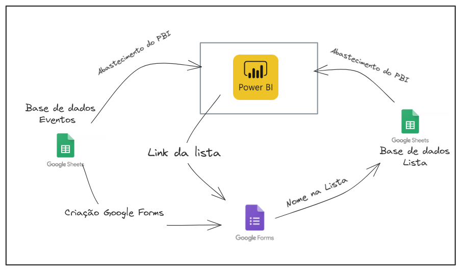

Tecnologias usadas: Power Bi, Power Query, Google Sheets, Google Forms, Google Apps Scripts 

Problemática: O cliente trabalha com produção de eventos por meio da venda de ingressos com seu cupom assim como a geração de uma lista de pessoas pro evento.  

Nesse contexto, foi criado um dashboard pelo PBI que mostrasse os eventos em que o produtor trabalhava, mostrando também sua lista de convidados e URL para compra do ingresso ou do Google Forms para inserção do nome na lista. 

O projeto conta com 2 base de dados: 

Base de dados da festa que o produtor ia atualizando. 

Base de dados das listas das festas que as pessoas iam preenchendo no Google Forms. 

 

A arquitetura do projeto pode ser demostrada como: 

O ETL dos dados é feito com Power Query.  

O Power BI foi utilizado para montar o painel do cliente. Google forms para ingestão de dados dos clientes.  

Google Sheets foi utilizado como base de dados. 

Google App Scripts para relacionar o Google Forms com Google Sheets, automatizando processos. 

O dashboard era atualizado em 6 horários diferentes e manualmente pelo Produtor. 